<!-- 这里放一段相册说明、拍摄器材、行程等。 -->

  

    <figure class="masonry-item"><a href="DSC05471.jpeg">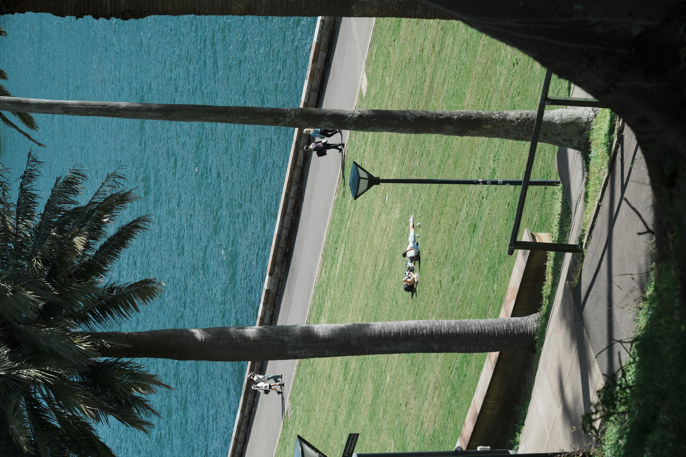</a></figure>
    <figure class="masonry-item"><a href="DSC05577.jpeg">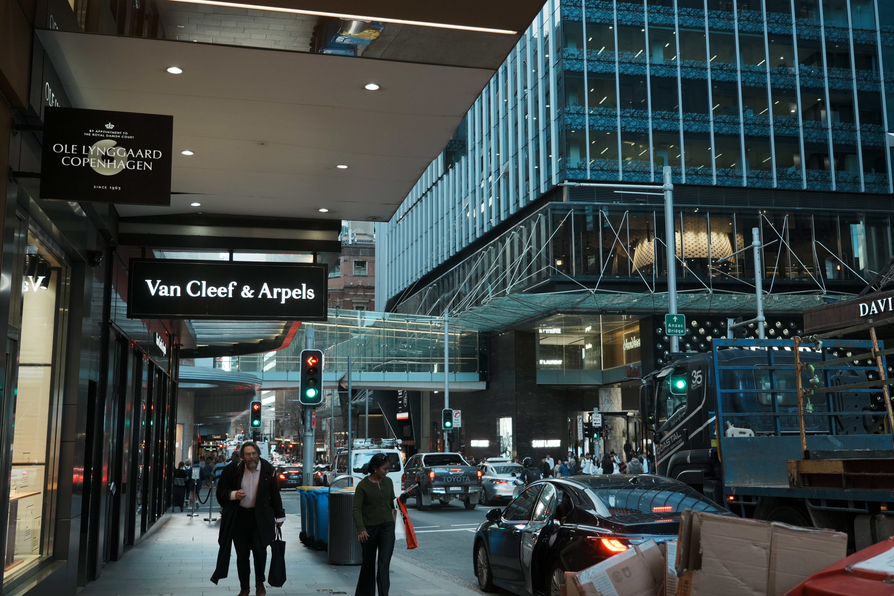</a></figure>
    <figure class="masonry-item"><a href="DSC05587.jpeg">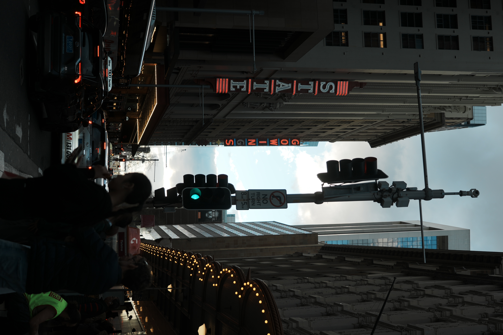</a></figure>
    <figure class="masonry-item"><a href="DSC05663.jpeg">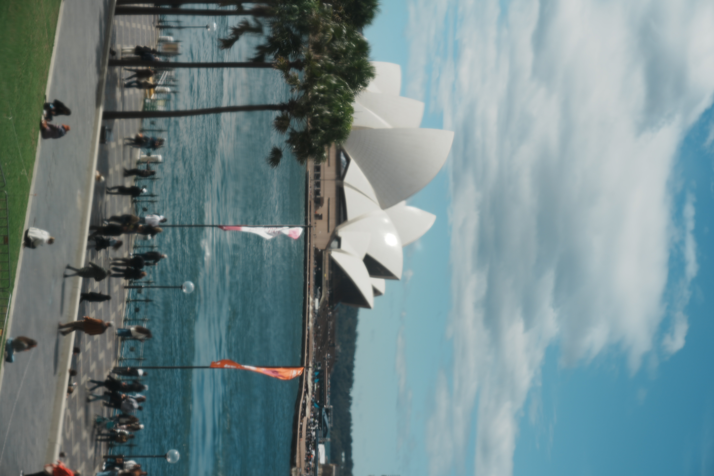</a></figure>
    <figure class="masonry-item"><a href="DSC05691.jpeg">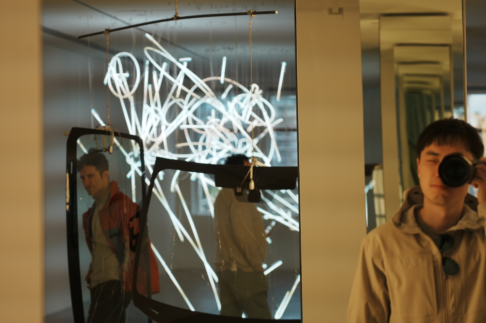</a></figure>
    <figure class="masonry-item"><a href="DSC05859.jpeg">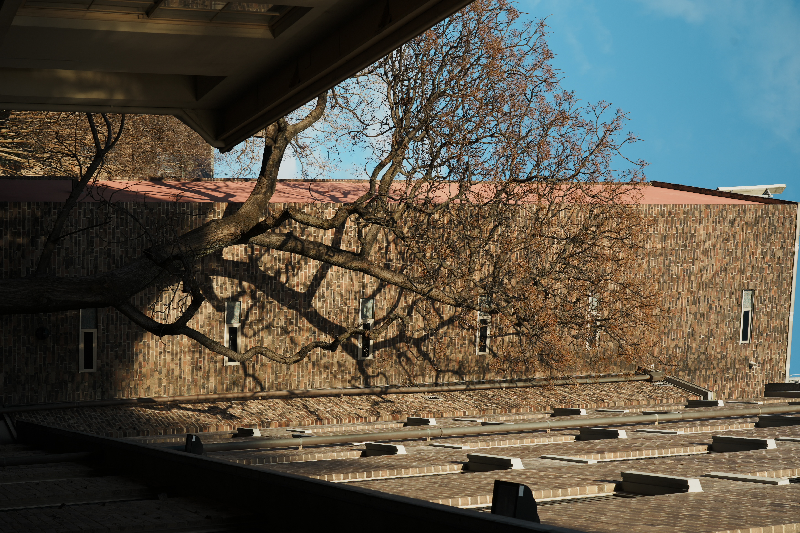</a></figure>
    <figure class="masonry-item"><a href="DSC05906.jpeg">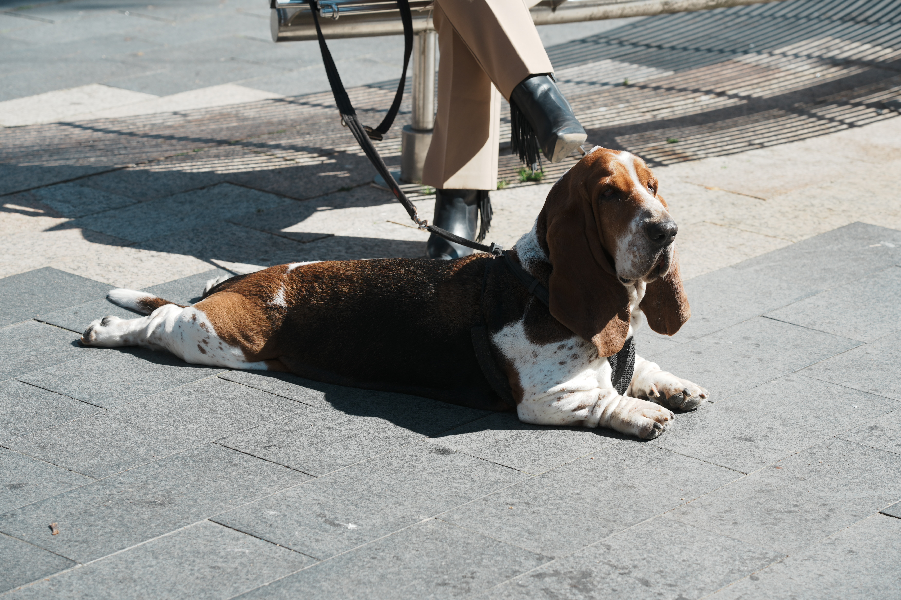</a></figure>
    <figure class="masonry-item"><a href="DSC05937.jpeg">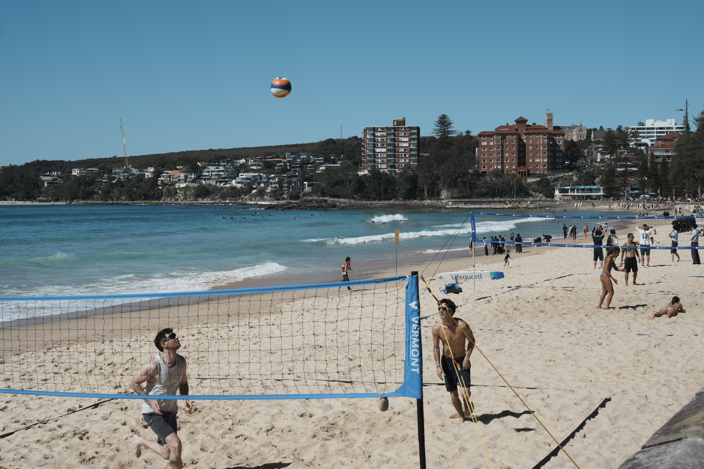</a></figure>
    <figure class="masonry-item"><a href="DSC06083.jpeg">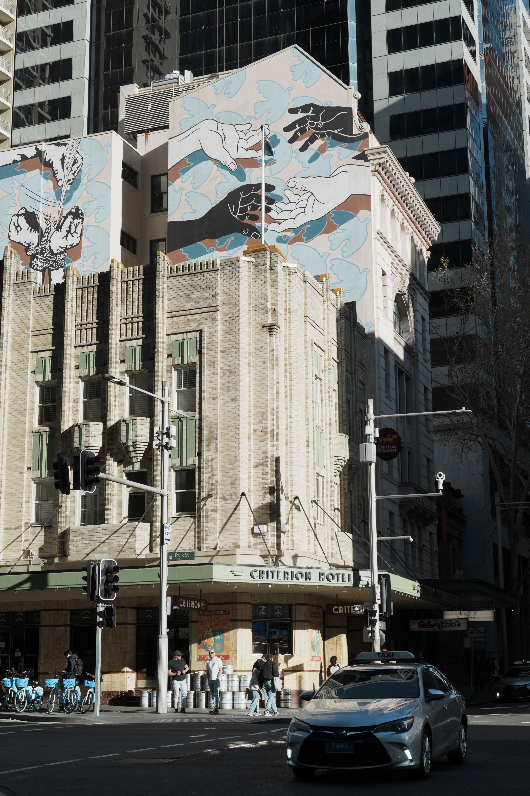</a></figure>
    <figure class="masonry-item"><a href="DSC06148.jpeg">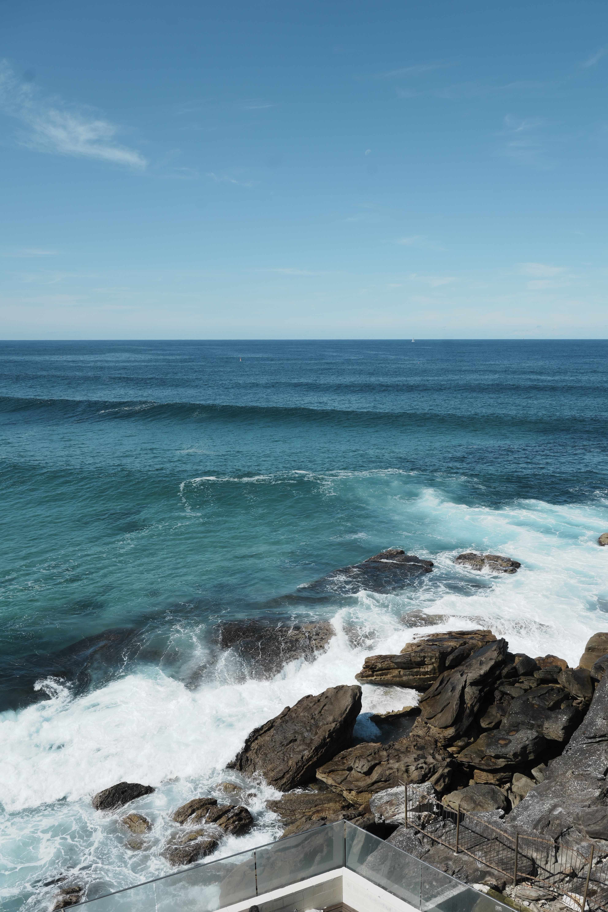</a></figure>
    <figure class="masonry-item"><a href="DSC06166.jpeg">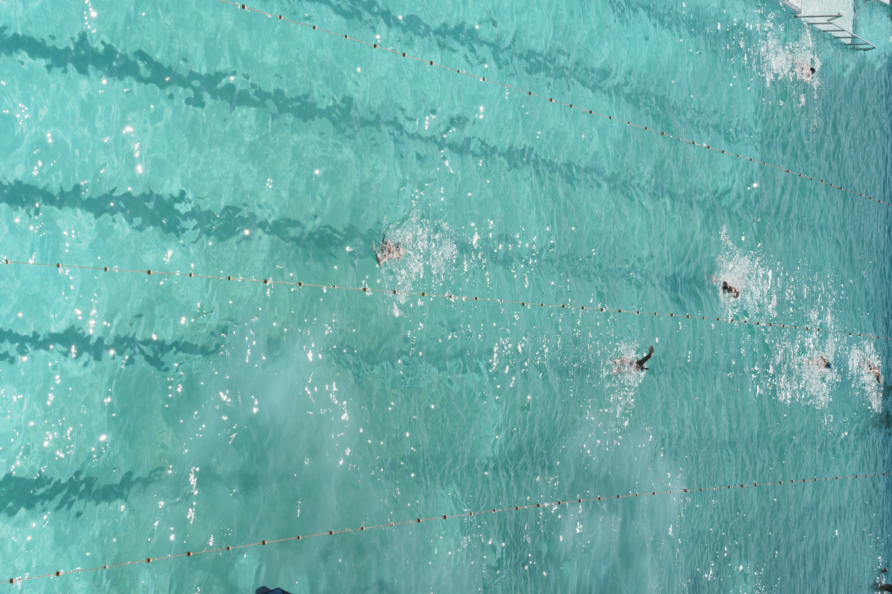</a></figure>
  

<dialog id="lightbox"></dialog>

