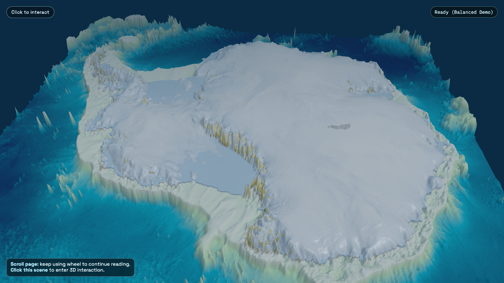

  <section class="explorer-hero">
    

      This 3D Antarctica experience is an interactive Antarctica map for exploring the Antarctic ice sheet in a way that ordinary static figures cannot. It combines bed topography, ice thickness, ice velocity, basin outlines, subglacial hydrology, and ocean-linked melt context in a single browser-based view. You can also switch into a Greenland 3D explorer built on the same workflow, compare balanced and HD datasets, and move from overview to detail without leaving the page. If someone searches for a 3D Antarctica tool, this is the page intended to explain it, preview it, and launch it.
    

    

      <a class="explorer-button explorer-button--primary" href="/tools/3D-interactive-cryosphere-explorer.html">Launch Explorer</a>
      <a class="explorer-button explorer-button--secondary" href="#watch-demo">Watch 45-second Demo</a>
    

    <figure class="explorer-hero-media">
      
      <figcaption>
        The live scene combines Antarctic topography, ice geometry, and polar context in a browser-ready 3D Antarctica map.
      </figcaption>
    </figure>
  </section>

  <section class="explorer-section">
    <h2>What you can explore</h2>
    

      <article class="explorer-card">
        <h3>Antarctic ice sheet geometry</h3>
        
Inspect bed topography, surface elevation, ice base elevation, and ice thickness across Antarctica in a single 3D frame.

      </article>
      <article class="explorer-card">
        <h3>Flow and subglacial systems</h3>
        
Toggle ice velocity, flowlines, effective pressure, and subglacial hydrology layers to see where fast flow and water pathways matter most.

      </article>
      <article class="explorer-card">
        <h3>Greenland 3D explorer mode</h3>
        
Switch regions to open the Greenland 3D explorer, including terrain, velocity, basin overlays, and ocean streamlines.

      </article>
      <article class="explorer-card">
        <h3>Resolution and viewing control</h3>
        
Choose balanced or HD datasets, adjust vertical exaggeration, change opacity, and reset the camera to move from storytelling to inspection.

      </article>
    

  </section>

  <section class="explorer-section">
    <h2>Why this is useful</h2>
    

      A standard Antarctica 3D map is often just a pretty globe. This tool is built as a scientific explainer: it lets readers, students, collaborators, and curious visitors understand how the Antarctic ice sheet sits on its bed, where ice velocity accelerates, and why subglacial hydrology and melt forcing matter for sea-level change. The same interface also makes it easier to communicate research results outside papers and conference slides.
    

    

      If you need an interactive Antarctica map that goes beyond a static screenshot, this landing page is the overview and the live explorer is one click away.
    

  </section>

  <section class="explorer-section">
    <h2>Data sources</h2>
    <ul class="explorer-source-list">
      <li><a href="https://nsidc.org/data/NSIDC-0756/versions/4" target="_blank" rel="noopener">MEaSUREs BedMachine Antarctica, Version 4</a></li>
      <li><a href="https://nsidc.org/data/NSIDC-0754/versions/1" target="_blank" rel="noopener">MEaSUREs Phase-Based Antarctica Ice Velocity Map, Version 1</a></li>
      <li><a href="https://data.aad.gov.au/metadata/RISE" target="_blank" rel="noopener">RISE Antarctic ice-shelf basal melting and ocean-driver data</a></li>
      <li><a href="https://zenodo.org/records/12738170" target="_blank" rel="noopener">Antarctic Wide Subglacial Hydrology Modeling</a></li>
      <li><a href="https://nsidc.org/data/NSIDC-0709/versions/2" target="_blank" rel="noopener">IMBIE refined basin boundaries for Antarctica</a></li>
      <li><a href="https://nsidc.org/data/idbmg4/versions/6" target="_blank" rel="noopener">BedMachine Greenland, Version 6</a></li>
      <li><a href="https://nsidc.org/data/NSIDC-0776/versions/2" target="_blank" rel="noopener">ITS_LIVE Greenland ice velocity mosaic</a></li>
      <li><a href="https://data.marine.copernicus.eu/product/ARCTIC_ANALYSISFORECAST_PHY_002_001/description" target="_blank" rel="noopener">Copernicus Marine Arctic Ocean physics analysis and forecast</a></li>
    </ul>
  </section>

  <section class="explorer-section">
    <h2>How to use it</h2>
    <ol class="explorer-howto">
      <li>Launch the explorer and start in Antarctica for the default balanced view.</li>
      <li>Rotate, zoom, and pan to inspect bed topography, grounding-zone context, and large-scale basin structure.</li>
      <li>Turn on ice velocity, flowlines, or subglacial hydrology to inspect dynamic patterns in the Antarctic ice sheet.</li>
      <li>Switch to Greenland when you want the Greenland 3D explorer with ocean streamlines and basin overlays.</li>
      <li>Use HD mode on desktop when you want more detail and your connection can handle larger datasets.</li>
    </ol>
  </section>

  <section id="watch-demo" class="explorer-section">
    <h2>Watch the demo</h2>
    

      The trailer below is the quickest way to preview what the interface can do before you open the full runtime.
    

    

      <video controls preload="metadata" poster="featured.png">
        <source src="/media/antarctica-greenland-explorer-trailer-v1.mp4" type="video/mp4" />
        Your browser does not support HTML5 video.
      </video>
    

  </section>

  <section class="explorer-section">
    <h2>FAQ</h2>
    

      

        
What is this 3D Antarctica map?

        
It is a browser-based 3D Antarctica explorer that combines bed topography, ice geometry, velocity, and scientific overlays into one interactive view.

      

      

        
Can I explore Greenland too?

        
Yes. The same interface includes a Greenland explorer mode with BedMachine terrain, ice velocity, basin overlays, and ocean streamlines.

      

      

        
What datasets does it use?

        
The explorer uses BedMachine, MEaSUREs and ITS_LIVE velocity products, Antarctic basin references, hydrology outputs, and Copernicus Marine ocean fields, all linked above.

      

      

        
Does it work on mobile?

        
Yes for exploration and demonstration, but the balanced dataset is the better default on phones and tablets. HD mode is best on desktop.

      

    

  </section>

  <section class="explorer-section explorer-final-cta">
    <h2>Launch the full explorer</h2>
    

      Ready to move from overview into the live runtime? Open the standalone explorer and start navigating Antarctica in 3D.
    

    

      <a class="explorer-button explorer-button--primary" href="/tools/3D-interactive-cryosphere-explorer.html">Launch Explorer</a>
      <a class="explorer-button explorer-button--ghost" href="/tools/">Browse all research tools</a>
    

  </section>

